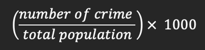
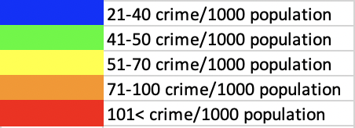

<h1> Safe Travels (BCHacks 4.0) </h1>
<h3><i>"Where we do the thinking for you"</i>  -Darren Evan</h3>
 

<h2>About Our Website</h2>
Picture having to travel but not being familiar with the place you are traveling to. This is where "Safe Travels" comes. 
"Safe Travels" is a website will help our fellow travelers decide where to stay by compiling various statistics about 
diferrent neigbourhoods in the area. One of the feature is highlighting neighbourhoods with different colours on their 
corresponding crime rates. Additionally, there are also multiple tags pinpointing the exact location of medical establishments, 
amenities, and skytrain stations. These tags could help travelers decide the location that best suits them. By using our website, 
travellers would not have to stress out planning everything!

 
<h2>How We Calculate the Crime Rate</h2>
Our website calculates the crime rate per neighbourhood. The formula that we used is: 

 

This would give us the number of crimes that happen per 1000 people in each neighbourhood.  

 
<h2>Crime Rate Index</h2>

 

 
<h2>Tags in Website</h2>

Skytrain Tag 

Pharmacy Tag 

Hospital Tag 

Clinic Tag 

Attraction Tag 

Shopping District Tag 

 
<h2>Future Improvements</h2>
- Include areas outside of Vancouver 
- Have a more accurate and consistent border per "neighbourhood" 
- Add more statistics such as bus stops, food locations, etc.  
- Add average prices for accomodations (hotels and AirBnB) 
- Add an algorithm that will select the neighbourhood based on travelers' preference on safety, public transport, etc. 
- Make the website available online (now it is local host and requires docker) 

 
<h2>Video Demonstration</h2>
Click below to watch a Demo of the Website: 
https://youtu.be/VPc8mdRd9q4
